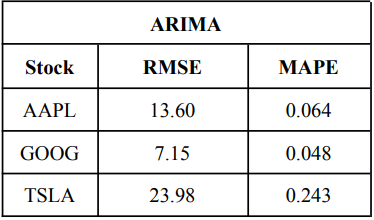
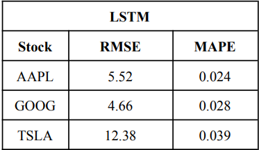
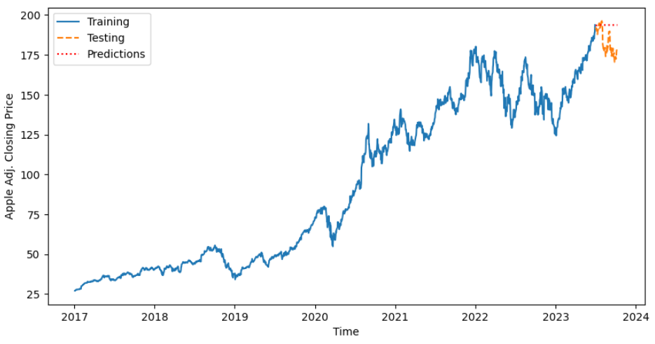
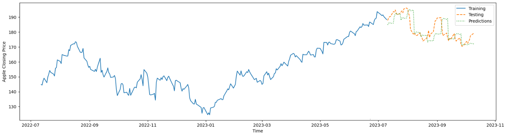
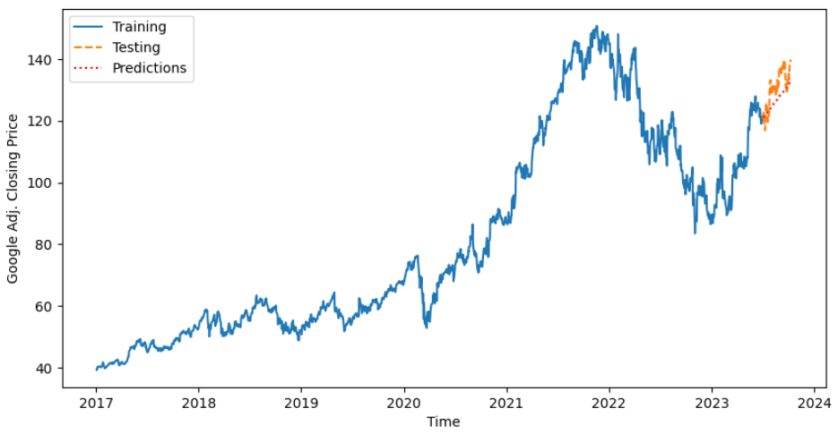
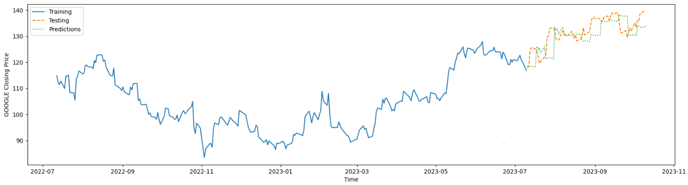
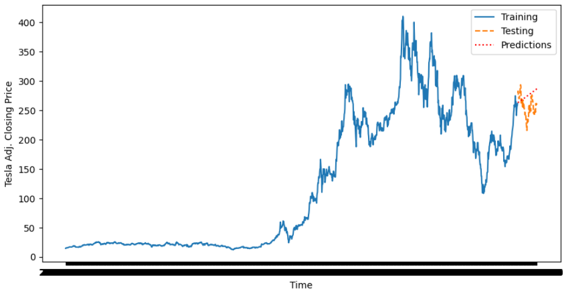
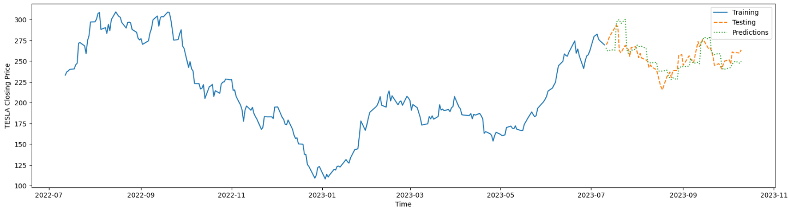

# Stock Price Prediction

### Overview
This project focuses on predicting stock prices for major companies, including Apple (AAPL), Tesla (TSLA), and Google (GOOG), using advanced forecasting models such as ARIMA and LSTM. The primary goal is to achieve accurate predictions and gain insights into stock price movements.

### Table of Contents
[Introduction](https://github.com/SmitPanchal1999/Stock-Price-Prediction/tree/main?tab=readme-ov-file#introduction) 
[Data Preprocessing and Exploratory Data Analysis](https://github.com/SmitPanchal1999/Stock-Price-Prediction/tree/main?tab=readme-ov-file#data-preprocessing-and) 
[ARIMA Model](https://github.com/SmitPanchal1999/Stock-Price-Prediction/tree/main?tab=readme-ov-file#arima-model) 
[LSTM Model](https://github.com/SmitPanchal1999/Stock-Price-Prediction/tree/main?tab=readme-ov-file#lstm-model) 
[Results](https://github.com/SmitPanchal1999/Stock-Price-Prediction/tree/main?tab=readme-ov-file#results) 
[Graphs Discussion](https://github.com/SmitPanchal1999/Stock-Price-Prediction/tree/main?tab=readme-ov-file#graphs-discussion) 
[Conclusion](https://github.com/SmitPanchal1999/Stock-Price-Prediction/tree/main?tab=readme-ov-file#conclusion) 
[Future Work](https://github.com/SmitPanchal1999/Stock-Price-Prediction/tree/main?tab=readme-ov-file#future-work) 
[Technologies Used](https://github.com/SmitPanchal1999/Stock-Price-Prediction/tree/main?tab=readme-ov-file#technologies-used) 
[How to Run the Code](https://github.com/SmitPanchal1999/Stock-Price-Prediction/tree/main?tab=readme-ov-file#how-to-run-the-code) 
[References](https://github.com/SmitPanchal1999/Stock-Price-Prediction/tree/main?tab=readme-ov-file#references) 

### Introduction
Stock price prediction is a critical aspect of financial analysis, helping investors make informed decisions. This project explores the use of ARIMA and LSTM models for accurate predictions, leveraging historical stock data.

### Data Preprocessing and EDA
Data preprocessing involved cleaning and organizing the stock data for analysis. Exploratory Data Analysis (EDA) techniques were employed to gain insights into stock price trends, correlations, and moving averages, enhancing the effectiveness of the predictive models.

### ARIMA Model
The AutoRegressive Integrated Moving Average (ARIMA) model was utilized for its ability to capture time series patterns. The Dickey-Fuller test assessed stationarity, and logarithmic transformation was applied to handle non-stationarity. ARIMA successfully predicted stock prices, considering historical patterns.

### LSTM Model
Long Short-Term Memory (LSTM) networks, a type of recurrent neural network (RNN), were employed for their capability to capture sequential dependencies in time series data. The custom learning rate was implemented to optimize model training. The LSTM model demonstrated superior performance compared to ARIMA.

### Results
Detailed results for each stock (AAPL, TSLA, GOOG) are as follows:

### Graphs Discussion
Graphs depicting the predicted vs. actual stock prices for each company were analyzed. The visual representations provided additional insights into the models' performance and their ability to capture price trends accurately.

### Conclusion
In conclusion, the LSTM model outperformed ARIMA in stock price prediction, achieving lower RMSE and MAPE values. This project highlights the significance of leveraging advanced machine learning models for accurate financial forecasting.

### Future Work
Future work may involve exploring additional deep learning architectures, incorporating external factors affecting stock prices, and enhancing the models for broader market applications.

### Technologies Used
Python
TensorFlow
Pandas
Matplotlib
Scikit-learn

### How to Run the Code
Clone the repository.
Run the Jupyter notebooks for ARIMA and LSTM models.

## References
